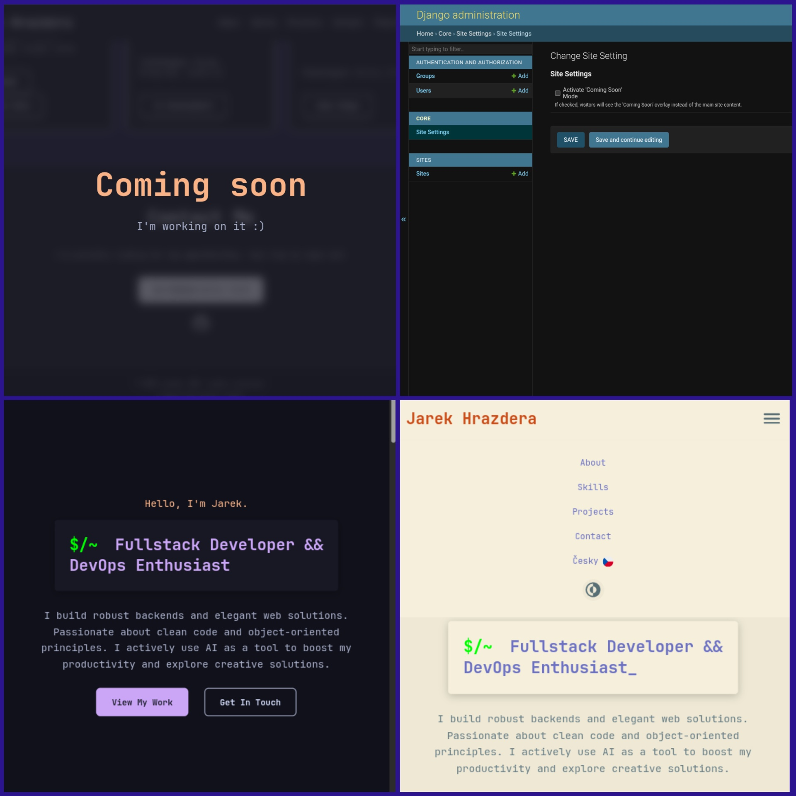

# Portfolio Jaroslav Tech

[](https://github.com/jardahrazdera/portfolio-jaroslav-tech/actions/workflows/deploy.yml)

Welcome to the official repository for my personal portfolio, [jaroslav.tech](https://jaroslav.tech). This project is more than just a website; it's a comprehensive demonstration of my capabilities in full-stack web development, showcasing a robust backend built with Python and Django, a clean frontend, and modern, automated DevOps practices.

## 🎯 DevTracker - Project Management System

The portfolio now includes **DevTracker**, a comprehensive project management system built with Django that demonstrates advanced web development capabilities:

- **6 Django Models** with complex relationships (Project, Task, TimeLog, Tag, Technology, ProjectStatus)
- **Authentication & Authorization** with separate user and admin interfaces
- **Time Tracking System** with full CRUD operations for logging work hours
- **Project Organization** with public/private visibility controls and user separation
- **Progress Tracking** with visual progress bars and completion metrics
- **Responsive Design** using Catppuccin theme with light/dark mode support

**Access DevTracker:** Available at `/tracker/` with demo projects showcasing real development workflows.

[](https://jaroslav.tech/tracker/)

---

## 🚀 Live Demo

You can view the live site at: **[https://jaroslav.tech](https://jaroslav.tech)**

**Click to the picture to see a short video on Vimeo.com:**

<a href="https://vimeo.com/1104136541" target="_blank" rel="noopener noreferrer">
  
</a>

---

## ✨ Key Features

This project is built with a focus on modern features and best practices to ensure a great user experience and easy maintenance.

* **Fully Responsive Design:** The user interface is crafted with a mobile-first approach, ensuring a seamless experience across all devices. It uses a combination of CSS Flexbox and Grid along with media queries to adapt flawlessly to any screen size, from small mobile phones to large desktop monitors.
* **Light & Dark Mode:** The application includes a theme switcher that supports both light and dark modes. It automatically detects the user's operating system preference via the `prefers-color-scheme` media query. The user's choice is then saved in their browser's `localStorage`, so their selected theme persists across sessions. This is implemented using CSS variables for easy color management.
* **Internationalization (i18n):** To reach a broader audience, the website is fully bilingual (Czech and English). This is achieved using Django's built-in internationalization framework, including `gettext` for translating strings in both the backend and templates. The language can be switched seamlessly via a UI control that updates the session's language setting.
* **Dynamic Content Management:** To avoid hardcoding content, most of the text and configuration on the site is managed through a customized Django admin panel. This allows for easy updates without touching the codebase. For instance, project descriptions, job titles, and even the "Coming Soon" mode can be toggled with a simple checkbox in the admin.
* **Singleton Pattern for Global Settings:** To manage site-wide settings, the project employs the Singleton design pattern for a specific Django model. This ensures that there is only one row in the database for global configurations (like the "Coming Soon" switch), preventing inconsistencies and providing a single source of truth for the application's state.
* **Clean and Sustainable Code:** The codebase adheres to the PEP 8 style guide and emphasizes readability and maintainability. It follows the "fat models, thin views" philosophy, with clear separation of concerns. Comprehensive comments and a logical project structure make the code easy to navigate and understand for other developers.
* **Automated Deployment with CI/CD:** The entire deployment process is automated using GitHub Actions. Every push to the `main` branch triggers a workflow that builds, tests, and deploys the application to the production server. This ensures that every update is delivered quickly, reliably, and consistently, minimizing the risk of human error.

---

## 🛠️ Tech Stack

The project leverages a modern and robust technology stack to deliver high performance and scalability.

<p align="left">
  <a href="https://www.python.org" target="_blank" rel="noreferrer"></a>
  <a href="https://www.djangoproject.com/" target="_blank" rel="noreferrer"></a>
  <a href="https://www.postgresql.org" target="_blank" rel="noreferrer"></a>
  <a href="https://www.docker.com/" target="_blank" rel="noreferrer"></a>
  <a href="https://docs.github.com/en/actions" target="_blank" rel="noreferrer"></a>
  <a href="https://developer.mozilla.org/en-US/docs/Web/HTML" target="_blank" rel="noreferrer"></a>
  <a href="https://developer.mozilla.org/en-US/docs/Web/CSS" target="_blank" rel="noreferrer"></a>
  <a href="https://developer.mozilla.org/en-US/docs/Web/JavaScript" target="_blank" rel="noreferrer"></a>
</p>

---

## 📂 Project Structure

The project uses a `src` layout for a clean separation between the application code and the project's root-level configuration files (like `docker-compose.yml`).

```
.
├── .github/              # CI/CD workflows (GitHub Actions)
├── .gitignore            # Files and directories ignored by Git
├── docker-compose.yml    # Docker configuration for services
├── LICENSE               # MIT License
├── README.md             # You are here!
└── src/                  # Main source code directory
    ├── core/             # The primary Django application (portfolio)
    │   ├── models.py     # Database models
    │   ├── views.py      # View logic
    │   ├── urls.py       # App-specific URL routing
    │   └── templates/    # HTML templates
    ├── devtracker/       # DevTracker project management app
    │   ├── models.py     # 6 models: Project, Task, TimeLog, Tag, Technology, ProjectStatus
    │   ├── views.py      # Class-based views with authentication
    │   ├── forms.py      # Model forms for project and time management
    │   ├── urls.py       # DevTracker URL patterns
    │   ├── templates/    # DevTracker-specific templates
    │   ├── management/   # Custom Django commands for demo data
    │   └── tests.py      # Comprehensive test suite
    ├── jaroslav_tech/    # Django project-level configuration
    │   ├── settings.py   # Project settings
    │   └── urls.py       # Root URL configuration
    ├── manage.py         # Django's command-line utility
    └── requirements.txt  # Python dependencies
```

## ⚙️ Local Development

To run the project on your local machine, you can choose one of the following methods. The Docker method is recommended as it perfectly mirrors the production setup.

### Method 1: Running with Docker (Recommended)

This approach automatically sets up the application, database, and all dependencies in isolated containers.

1.  **Clone the repository:**
    ```bash
    git clone [https://github.com/jardahrazdera/portfolio-jaroslav-tech.git](https://github.com/jardahrazdera/portfolio-jaroslav-tech.git)
    cd portfolio-jaroslav-tech
    ```

2.  **Create the `.env` file:**
    This file stores your environment-specific configurations. Copy the example file to create your own.
    ```bash
    cp .env.example .env
    ```
    For local development, you only need to ensure `DEBUG=True` is set. The default database credentials will work with Docker Compose out of the box.

3.  **Run with Docker Compose:**
    This single command builds the Docker image from the `Dockerfile`, creates a network for the containers to communicate, and starts the web application and PostgreSQL database services.
    ```bash
    docker compose up --build
    ```

4.  **The application is now running** with multiple access points:
    - **Portfolio:** Main site at `http://localhost:8000`
    - **DevTracker:** Project management at `http://localhost:8000/tracker/`
    - **Admin Panel:** Database management at `http://localhost:8000/admin`

### Method 2: Running Locally without Docker

This method is for developers who prefer to run the application directly on their host machine. It requires Python and PostgreSQL to be installed.

1.  **Clone the repository and navigate to the `src` directory:**
    ```bash
    git clone [https://github.com/jardahrazdera/portfolio-jaroslav-tech.git](https://github.com/jardahrazdera/portfolio-jaroslav-tech.git)
    cd portfolio-jaroslav-tech/src
    ```

2.  **Create a virtual environment and install dependencies:**
    It's a best practice to isolate project dependencies.
    ```bash
    python -m venv venv
    source venv/bin/activate
    pip install -r requirements.txt
    ```

3.  **Set up environment variables:**
    Create a `.env` file inside the `src` directory and configure it to connect to your local PostgreSQL instance.
    ```
    # Example .env file in src/
    SECRET_KEY=yourlongrandomsecretkey
    DEBUG=True
    POSTGRES_DB=portfolio_db
    POSTGRES_USER=user
    POSTGRES_PASSWORD=password
    POSTGRES_HOST=localhost
    POSTGRES_PORT=5432
    ```

4.  **Run database migrations and create a superuser:**
    This sets up the database schema and creates an admin account.
    ```bash
    python manage.py migrate
    python manage.py createsuperuser
    ```

5.  **Start the development server:**
    ```bash
    python manage.py runserver
    ```

6.  **The application is now available** with multiple access points:
    - **Portfolio:** Main site at `http://localhost:8000`
    - **DevTracker:** Project management at `http://localhost:8000/tracker/`
    - **Admin Panel:** Database management at `http://localhost:8000/admin`

---

## 🔄 Deployment & CI/CD

The project is configured for a fully automated, zero-downtime deployment using **GitHub Actions**. This CI/CD pipeline ensures that every change pushed to the `main` branch is automatically and safely deployed to production.

**The deployment process is as follows:**

1.  **Trigger:** The workflow is automatically triggered by a `push` event to the `main` branch.
2.  **Build Docker Image:** A new Docker image is built based on the `src/Dockerfile`. This image contains the application code and all its dependencies, ensuring a consistent environment.
3.  **Push to GitHub Container Registry (GHCR):** The newly built image is tagged and pushed to GHCR, a private container registry provided by GitHub.
4.  **Deploy to Production Server:**
    * The workflow securely connects to the production server using SSH keys stored in GitHub Secrets.
    * It pulls the latest version of the `docker-compose.yml` file from the repository to ensure the server has the latest service definitions.
    * It runs `docker compose pull` to download the new application image from GHCR.
    * The services are gracefully restarted using `docker compose up -d`. Docker handles the process of stopping the old container and starting the new one with minimal downtime.
    * Finally, post-deployment commands (`migrate`, `collectstatic`, `compilemessages`) are executed inside the newly running application container to apply any database changes and update static files or translations.

This automated process not only accelerates the development cycle but also enhances reliability by eliminating manual deployment steps.

---

## 🧪 Testing & Quality Assurance

This project is committed to maintaining a high standard of code quality and stability. To achieve this, a comprehensive suite of automated tests has been developed using Django's built-in `TestCase` framework.

The goal of these tests is to ensure that all core functionalities work as expected and to prevent regressions as the project evolves.

### Test Coverage

The test suite is designed to cover various layers of the application:

* **View & Template Integrity:** Tests verify that all primary views return a successful status code (`200 OK`) and that they render the correct templates. This ensures the basic navigation and structure of the site remain intact.
* **Context Data Validation:** We test that the correct context data is passed to the templates. For example, we verify that the `general_setup` object from the context processor is available, ensuring dynamic data from the database is displayed properly on the frontend.
* **Business Logic & Design Patterns:** Beyond standard checks, the tests validate the core application logic. A key example is the test for the **Singleton pattern** on the `GeneralSetup` model. This critical test guarantees that the architectural rule of having only one instance of site-wide settings is strictly enforced, preventing potential configuration conflicts.

### Automated Testing with GitHub Actions

To fully automate the testing process, a dedicated **Continuous Integration (CI)** pipeline has been set up using GitHub Actions. This workflow runs independently of the deployment pipeline and focuses solely on quality assurance.

[](https://github.com/jardahrazdera/portfolio-jaroslav-tech/actions/workflows/django-ci.yml)

This CI workflow is configured to run on multiple triggers for comprehensive coverage:
* **On every `push` and `pull request`** to the `main` branch, providing immediate feedback on new changes.
* **On a regular schedule (nightly),** which helps to catch any potential issues that might arise over time, such as upstream dependency breakages or subtle bugs that were not triggered by recent commits.

The workflow's job is to:
1.  Set up a clean Python environment.
2.  Install all project dependencies from `requirements.txt`.
3.  Run the entire test suite.

This multi-pronged approach acts as a robust safety net, ensuring that the project's stability and integrity are maintained at all times.

---

## 📫 Contact

If you have any questions, suggestions, or just want to connect, feel free to reach out.

* **GitHub:** [jardahrazdera](https://github.com/jardahrazdera)
* **Email:** [jarek@jaroslav.tech](mailto:jarek@jaroslav.tech)